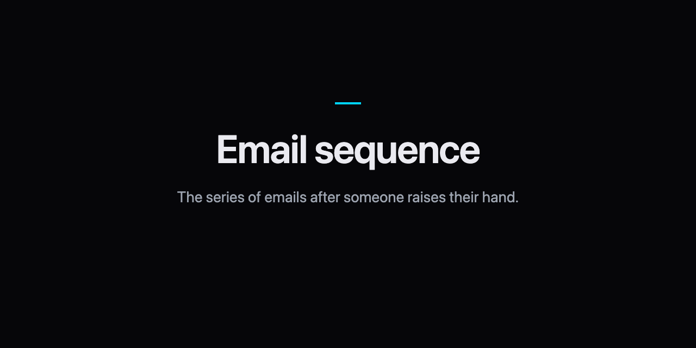
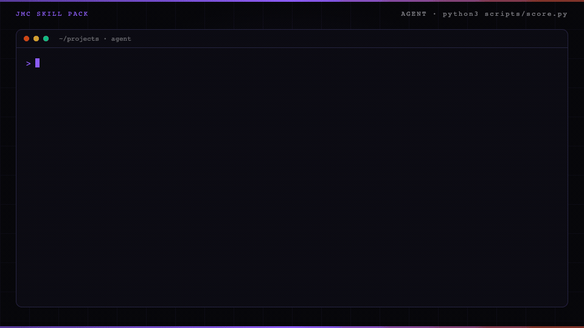

<p align="center">
  
</p>

# Email sequence skill for Claude Code

An email sequence is the series of emails after someone raises their hand.

The sample starts with the trial checklist they asked for.

The good draft passes. A generic drip fails the score.

<p align="center">
  
</p>

The build guide teaches a human. The pack teaches an agent.

## Install

In Claude Code, install it from the suite marketplace:

```
/plugin marketplace add cmj-hub/gtm-operator-skills
/plugin install email-sequence@gtm-operator-skills
```

Other agents (Codex, Cursor, and the rest) can install it with the skills CLI:

```
npx skills add cmj-hub/claude-email-sequence --all -g --full-depth
```

Or clone the repository and open the tree on the host you already run.

The scorer is Python in this repo. Host paths are on the [Skill packs catalog](https://jaymountconsulting.com/skills).

In Claude Code the repo is a plugin named `email-sequence`. Its one skill is `lifecycle-email`, so the command is `/email-sequence:lifecycle-email`. The agent also picks it up on its own when you ask for a welcome, onboarding, or nurture sequence.

## What you walk out with in 15 minutes

Artifact: `examples/lifecycle-good.json`.

```
python3 scripts/score.py --file examples/lifecycle-good.json
python3 scripts/score.py --file examples/lifecycle-refused.json
```

The good draft exits 0 and prints the welcome, the bargain, and the nurture. The refused draft exits 1 and names each gate it failed:

```
a generic drip and a cold email
- cold email: welcome says "introduce our"
- generic drip: bargain says "Day 1"
- generic drip: nurture says "generic drip"
- cold email: nurture says "cold email"
- pain mismatch: nurture does not repeat the pain in their words
- no opt-in: welcome does not say they asked, opted in, or signed up
```

Then drop in yours. Add `--json` when another tool reads the result. `examples/lifecycle-subjects.json` adds the optional subject lines.

## What this pack will not do

It will not send the email. It does not write a generic drip. It will not write a cold email.

## Does this include a newsletter?

One issue can sit inside the sequence. A newsletter product is not a separate pack.

## Does this send the sequence?

No. It scores the draft. Your email tool sends it.

## On the site

- [Email sequence pack](https://jaymountconsulting.com/skills/claude-email-sequence) — this pack's page
- [Skill packs catalog](https://jaymountconsulting.com/skills) — install paths + every pack

## Free, no signup

[All free tools](https://jaymountconsulting.com/prototypes)

## Free, by email

[**Growth Audit**](https://jaymountconsulting.com/growth-audit) — architecture gaps in the GTM you already run. Free written report.

[**Friday Signal**](https://jaymountconsulting.com/newsletter/signal) — one Friday GTM read. No pitch in it.

## Next

Previous: [Cold email](https://github.com/cmj-hub/claude-cold-email)

Next: [Sales prospecting](https://github.com/cmj-hub/claude-prospect-list)

## Privacy and security

The scorer is local Python 3 standard library. It reads the draft JSON you pass it and nothing else; the skill reads `brand-config.json` if present and writes no file outside your draft. No script opens a network connection. No telemetry, no credentials, and nothing is sent. See [SECURITY.md](SECURITY.md).

## License

MIT. No paid APIs. Python 3 standard library only.
